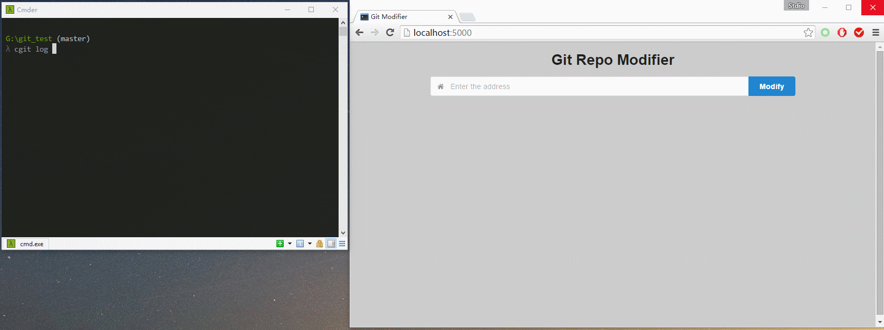

# git_modifier

Modify commit author and commit date information of a git repo using `GitPython`.

Requirements:

> GitPython==1.0.2  
> 
> Flask==0.10.1

## How to use

1. Install all the python dependencies via `pip`
2. `python main.py`, run the flask app (You have to run the app **locally**)
3. Copy the path of the git repo that you want to modified
4. Do what the picture above does.

## How to modify the front end scripts

Run `gulp build` to transform `static/src/main.js` from babel to javascript offline and compress it. The transformed script file is placed in `static/build`. See [here](https://facebook.github.io/react/docs/getting-started.html#using-react-from-npm) and the [gulpfile](./gulpfile.js) for more information.

## 吐槽

修改repo的作者和时间信息​，真是个奇怪的需求:joy:​

具体细节：

1. 使用`GitPython`读取某分支的所有commit及其sha, commit时间，作者名字及邮箱
2. 将所有commit显示，由用户决定是否修改、修改哪一项
3. 将用户选择拼成一个shell脚本
4. 在本地执行脚本